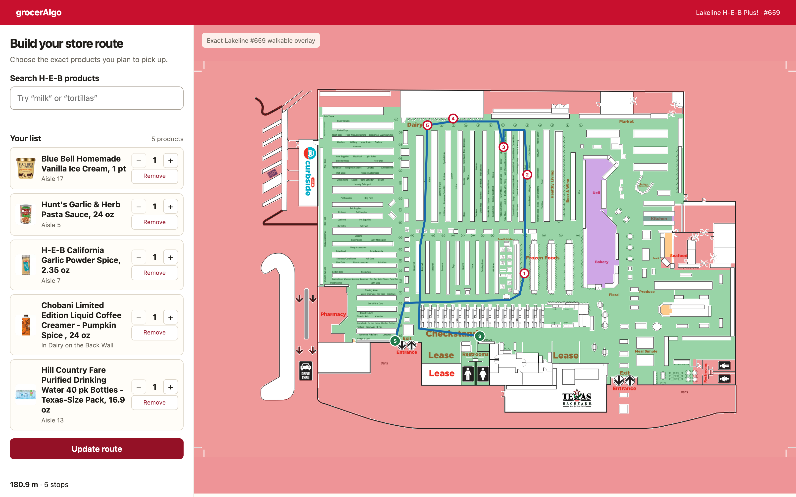
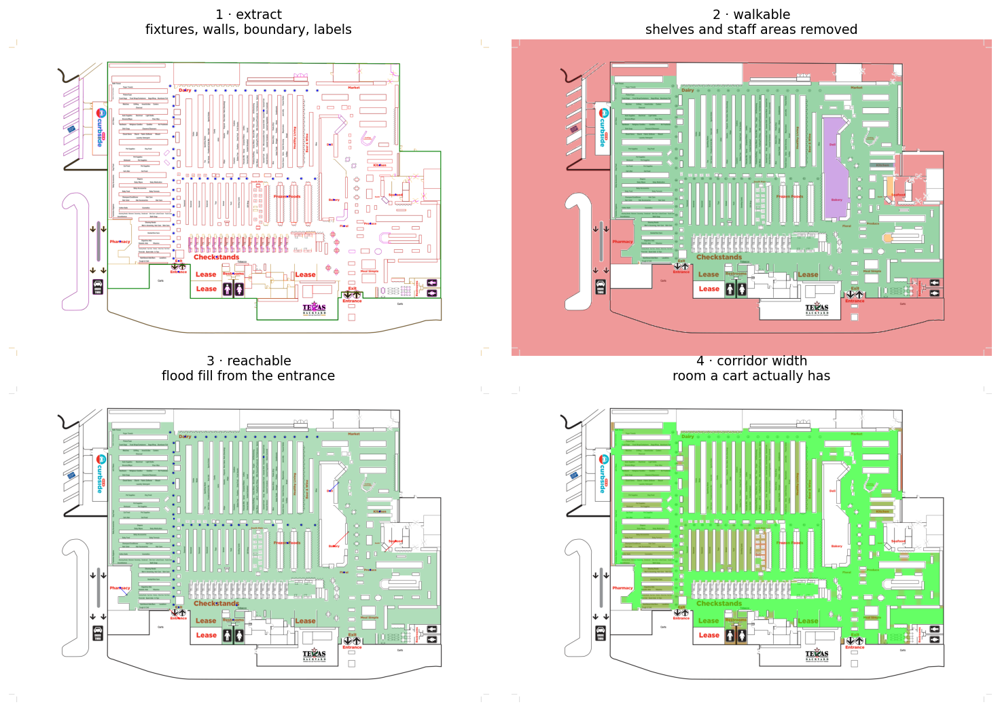
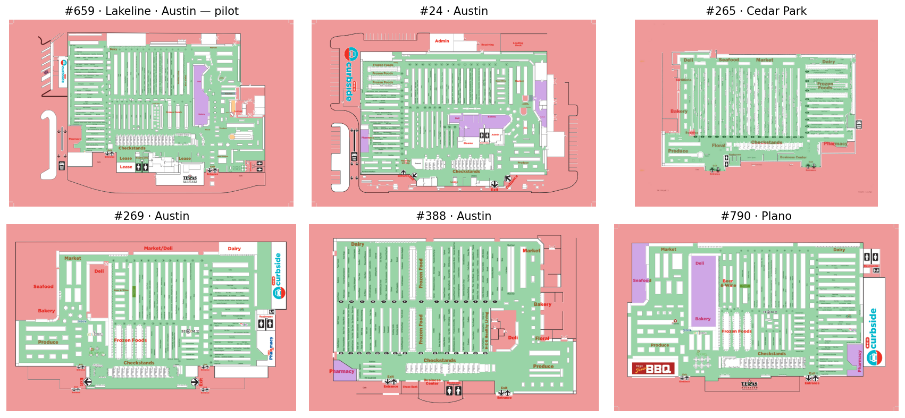

# grocerAlgo

**Turn a grocery list into the shortest walk through your actual store.**
Entrance → every item → checkout, drawn on the real floor plan, ordered by a
solver instead of by whatever order you happened to write things down.



---

## The problem

A list is written in recall order. A store is laid out in aisle order. Those
two things have nothing to do with each other, so you backtrack — a lot.

Measured on our pilot store with a real 25-item list:

| | |
|---|---|
| Walking the list as written | **818 m** |
| Walking the optimal route | **426 m** |
| Saved | **392 m — 48%** |
| Time to compute | **216 ms** |

Store apps will tell you the aisle for *one* item at a time. None of them
sequence the whole trip. That gap is the product.

---

## Where it is today

A working local app with a **store picker**, a map pipeline that has onboarded
**7 stores**, and an in-app button to onboard the next one.

- Search H-E-B's **live catalog** — real products, real stock state, real
  shelf labels, scoped to one store.
- Pick exact products, set quantities, get a numbered route on the floor plan.
- Route re-solves on every list change in **under a second**.
- Items H-E-B can't place are shown as explicitly unrouted, never dropped.

**A store is only offered once it can place products exactly.** Being mapped is
not enough: the store's live Atlas has to be captured and calibrated onto its
guide, and that calibration has to pass its gates. **Six of the seven pass** —
24, 265, 269, 659, 790 and 811, each landing 99.4–100% of its shelf positions
on walkable floor. #388 does not: its guide is a 2011 drawing of a store that
has since been remodelled. The map converges and the geometry even calibrates
cleanly, but live shelf labels disagree with where products land — 0 of 11
checks, and not by any single shift a pin could express — so it is listed with
that reason instead of being served pins that only look precise. `discover.py`
now reads those tells off the PDF itself (creation year, foreign store number
in the title, QuarkXPress tooling, sparse drawings) and warns before an
onboarding run is spent.

Against the goals in [`plan.md`](plan.md):

| Goal | Target | Now |
|---|---|---|
| G1 · route quality | ≥30% shorter than list order | **48%** |
| G2 · coverage | ≥85% of items auto-located | **92%** (23/25) |
| G3 · speed | <1 s p95 | **216 ms** |
| G5 · onboarding | new store routable in <1 h human time | one command + agent loop |

---

## How it works

Three problems. The third one is the easy one.

### 1 · Where is each item, in *this* store?

The hard one, and the real bottleneck. H-E-B exposes per-store product
locations through PALS — a product resolves to a PSA (a spot on a specific
shelf face) and a printed label like "Aisle 17" or "In Dairy on the Back Wall".
grocerAlgo drives a local browser session to read the catalog the way a
customer's browser does, then maps each PSA onto the store's floor plan.

That mapping is a per-store transform, and it has to be *earned* before the
store is offered. `capture_atlas.py` pulls the store's live Atlas; `calibrate.py`
searches for the correspondence between the two drawings' aisle numbers — #659's
left-hand column is numbered four lower on the guide than on today's shelf
labels — and then tries to disprove the answer it found:

| Gate | What it rules out |
|---|---|
| residual ≤ 3 pt over ≥8 anchors per axis | a fit dragged by outliers (#659: 2.2 pt / 32) |
| scale within 5% between axes | an offset the aisle pitch absorbed into its intercept |
| ≥99% of PSAs land on reachable floor | a transform that puts products inside the shelves |
| live labels agree (`--verify`) | everything above being self-consistent and still wrong |

On #659 the search recovers the hand-derived correspondence on its own, and
places products within **1 pt** of the calibration a human spent a day on. On
#24 it disagreed with its own first answer: the correspondence two aisles off
had *more* agreeing anchors and put a fifth of the store's shelves inside the
fixtures, which is why the floor decides the correspondence and the anchors
only break ties.

Some stores have no aisle spanning one axis at all — every numbered aisle in one
row — so that axis has nothing to fit. Its scale comes from the other axis,
because both drawings are to scale, and its offset is found by sliding the
shelves along until they land on the floor. That is how 265 and 388 are fitted.

**Exact means exact.** A product is drawn as a shelf position only when H-E-B
gave shelf geometry for it *and* that store passed those gates. When PALS
answers with a department instead — "In Produce" — the pin is drawn as a
department, because that is all anyone knows. Across a real session's 156
placements, 85 were shelf-exact with a median snap of 0.9 pt; the other 71 were
departments, and pretending otherwise would have been a nicer-looking lie.

### 2 · Turn a map image into a routable graph

H-E-B publishes a store guide as a vector PDF. The pipeline turns that into a
walkable grid — and then *proves* it walkable, because a map that merely looks
right will happily route you through a freezer.



```
guide-<city>-<store>.pdf        discover.py finds and downloads this
  → extract.py                  geometry.json — fixtures, walls, boundary, labels
  → router/derive.py            per-store zones + seal zones, auto-derived
  → build_profile.py            profile.npz — walkable grid, anchors, all-pairs D
  → map_qa.py                   qa/*.png + report.json (machine-readable)
```

**The algorithm is frozen and store-agnostic.** Every per-store difference
lives in small JSON files under `data/<store>/` — zones, seal zones,
exclusions, inclusions, walk truth. Adding a store means adding data, never
code. That constraint is what makes the sixth store as cheap as the second.



All six report zero VERIFY flags, zero sealed floor patches, and zero
unreachable shelf labels.

### 3 · Compute the optimal order

Solved. Fixed-endpoint TSP (exact Held-Karp, vectorised over popcount layers)
runs in milliseconds at grocery-list scale. Products sharing an aisle collapse
to one solver stop — you walk into an aisle once — while every item stays a
separately numbered pick. Each aisle is then entered from whichever end the
surrounding route prefers, rather than always from its numbered mouth.

---

## The road here

Some of it was the plan. The interesting parts were not.

**The map has to be proven, not eyeballed.** Early walkable grids looked
perfect and routed through a bakery counter. The pipeline now flood-fills from
the entrance and fails if any shelf label is unreachable or any patch of floor
is sealed off. Store 659's grid is frozen pixel-by-pixel — 63,445 walkable
cells in `data/659/golden_free.npy`. Any universal-rule change that moves one
blessed pixel fails the suite; re-blessing is a deliberate, documented act.

**Map annotations are not objects.** Badge hexagons, decorative trinkets and
aisle markers are printed *on* the floor. Treating them as fixtures walled off
corridors that are perfectly walkable in real life.

**Two drawings of the same store do not line up.** H-E-B's live Atlas map and
the printed guide are different vintages. The first calibration rubber-sheeted
Atlas coordinates through ~50 control points — all of them *label* positions,
lying on three near-collinear lines with nothing in the store interior where
products actually sit. The sliver triangles between them stretched aisle 17's
35 pt shelf run across 93 pt of map, so ice cream pinned two aisles from where
it was. Both are axis-aligned plans of one floor, so the honest model is one
scale and offset per axis: residual under 2.2 pt across 32 anchors, and a
shelf face now maps to a straight 4 pt line. Department *labels* are matched by
name instead of transformed, because the two drawings put "Dairy" 50 pt apart.

**Trust the label over the coordinate.** H-E-B answers for some bulk packs with
a pallet bay off the shopping floor while its own label names a real aisle — a
40-pack of water resolved to the vestibule and got snapped 32 m to the
entrance. Any placement landing more than 5 m from walkable floor is no longer
believed; the printed label wins. All 2,677 PSAs in the store are swept in CI
to keep it that way.

**One browser page, one navigation.** Typeahead fires overlapping searches, and
a second navigation aborts the first — which the client read as "H-E-B dropped
us" and answered by tearing down the whole browser. Every keystroke could kill
the session. Navigation is now serialised and a single failure retries.

---

## Tests

**598 tests**, ~47 s. The suite is weighted toward the things that are
expensive to get wrong.

| Suite | Tests | What it defends |
|---|---:|---|
| `test_walkability.py` | 374 | every store's floor: shelves solid, corridors open, no orphans |
| `test_stores.py` | 46 | the picker, onboarding queue, admin auth, per-store isolation |
| `test_api.py` | 23 | routing endpoints, placement, off-floor guards |
| `test_calibrate.py` | 17 | the fitter finds #659's answer, and refuses bad ones |
| `test_placement_state.py` | 4 | exact is earned; departments say department |
| `test_raster.py` | 21 | image-only guide fallback, gate by gate |
| `test_heb.py` | 20 | catalog parsing, session handling, concurrency |
| `test_legality.py` | 17 | no path ever crosses a fixture |
| `test_derive.py` | 14 | per-store config derives from labels alone |
| `test_coverage.py` | 15 | no section of a store goes unmapped |
| `test_corridor.py` | 10 | corridor width matches real cart capacity |
| `test_engine.py` | 8 | TSP, BFS, string pulling |
| `test_golden.py` + `test_route_golden.py` | 8 | frozen grid and frozen route, pixel-exact |
| others | 21 | directory resolution, extraction, PDF discovery + stale-guide preflight |

```bash
python3 -m pytest -q
```

The two golden suites are the tripwires. Everything else can be argued about;
those either match the blessed artifact or the build is red.

---

## Run it locally

```bash
pip install -r requirements.txt
brew install tesseract             # macOS — raster-PDF OCR fallback
# apt install tesseract-ocr        # Debian/Ubuntu

python3 -m uvicorn app:app --port 8000
# open http://localhost:8000
```

Pick a store in the header, then choose **Connect H-E-B**. A persistent local
Chrome profile opens — select that store there, return to the app, and confirm.
Each store gets its own profile (`.heb-<store>/`, gitignored), so switching
stores does not mean picking the store again. **grocerAlgo never stores
credentials**; the session belongs to your own browser profile.

One store at a time: H-E-B's own session carries the selected store, so the app
reports any other store as disconnected rather than quietly placing its products
through the wrong building's catalog.

Logs land in `logs/app.log` (rotating, gitignored): every catalog fetch with
timing, every disconnect with its exception, and every placement as
`atlas → mapped → shown` with the snap distance.

The Atlas snapshot that the connection check validates against lives in
`data/<store>-atlas/store-map.svg`, and is re-importable from it or from any
rendered H-E-B page:

```bash
python3 capture_atlas.py 659          # live: session -> data/659-atlas/
python3 import_heb.py data/659-atlas/store-map.svg --store 659   # offline replay
python3 calibrate.py 659 --verify     # fit, gate, and check live shelf labels
```

The connection fails closed: if H-E-B's drawing no longer matches the one a
store was calibrated against, that store stops placing products rather than
placing them from a stale transform.

### Onboarding another store

From the app: pick **＋ Onboard another store…** in the store menu, give a store
number, and watch the log. The same dialog resumes a run at a stage, lists the
stores that have a map but cannot place products, and runs **Verify with live
labels** on one — the step that settles an aisle correspondence the drawing
alone cannot, by asking the live catalog which aisle a product's own shelf label
names. It drives the browser, so that browser must be on the store being
verified. Or from a terminal:

```bash
./pipeline.sh <store>                 # store number in, routable store out
./pipeline.sh <store> Cedar Park      # city names are slugged automatically
./pipeline.sh <store> --no-agents     # mechanical stages only (smoke test)
./pipeline.sh <store> --from 6        # resume at a stage; stages 3-4 are ~50 min

./rebuild.sh <store>                  # rebuild + this store's tests + goldens
./rebuild.sh                          # 659 and the whole suite
```

discover → rebuild → onboarding agent ([`docs/onboarding.md`](docs/onboarding.md))
→ adversarial audit agent ([`docs/audit.md`](docs/audit.md)) → human visual
verdict → Atlas capture and calibration. Both agents fan the page out to
read-only crop inspectors and stay the only writer of the truth files.
Convergence means `rebuild.sh` exits 0, `report.json` has zero VERIFY flags and
empty coverage lists, and the audit role agrees. Final acceptance is still a
human looking at the walkable and reachable graphs.

`AUDIT CLEAN` describes the artifacts, not the sweep: an audit that finds three
real defects, repairs them in data and re-verifies is a good audit and ships as
`AUDIT CLEAN — store <N> (3 findings fixed)`. `AUDIT BLOCKED` means something is
still wrong. A blocked audit no longer abandons the run — calibration still
runs, and the store lands in the picker with a named reason instead of
vanishing, which is how store 811 spent a day looking like a crash.

### Onboarding all of them

```bash
python3 sweep_stores.py               # probe the CDN for every published guide → stores.txt
nohup ./fleet_drive.sh &              # drive everything in stores.txt, one store at a time
./fleet_drive.sh 658 660              # or just these stores
```

H-E-B publishes a guide for every store at a predictable URL, so the sweep
finds the whole fleet with HEAD requests, downloads and preflights each guide,
and orders `stores.txt` fresh-guides-first, stale-risk last. Each store runs
in its own git worktree pinned to a commit, so runs never tread on
development in the main checkout.

The driver is sequential and checkpoint-first: each store resumes at its
furthest completed stage (the worktree artifacts are the state), a finished
store is committed to main the moment its audit is clean, and when the Claude
session limit caps mid-run the driver parks itself until the reset time named
in the message and then retries the same store — a multi-day fleet run needs
no babysitting. Progress is in `logs/fleet/drive.log`; a killed run resumes
by running it again. Pipeline agents cannot spawn subagents
(`--disallowedTools`), so the usage rate stays flat and predictable.

Placement needs a logged-in browser, so the fleet defers it; it is paid down
later in batches from the main checkout with
`python3 capture_atlas.py <N> && python3 calibrate.py <N>`.

Vector guides use the standard extraction path. The image-only fallback is
still experimental — it passes the structural precision/recall, exact-aisle,
aisle-position, anchor and runtime gates on both OCR backends, but not the
boundary IoU gate, so normal runs reject raster guides.
Opt in with `GROCER_RASTER_EXPERIMENTAL=1`.

```bash
python3 raster_benchmark.py --backend tesseract   # scores every gate,
python3 raster_benchmark.py --backend vision      # exits nonzero on a miss
```

---

## Where it's going

Today this runs on one machine against one store account. Making it something
other people can use means solving one thing first:

**The catalog connection is a local browser session.** That is what makes the
data honest — it is the same page a customer sees — and it is exactly what
does not survive being moved to a server. A hosted version needs a real answer
here: a server-side session pool, an official data agreement, or a thin local
companion that keeps the browser on the user's own machine. This is the gate,
not the UI.

Behind that:

- **Mobile-first UI.** Check items off as you shop; the route re-solves from
  where you are. The solver is already fast enough to do this on every tap.
- **Frozen last.** Sequence the freezer aisle near checkout so ice cream
  survives the trip. A soft constraint on the TSP, not a new algorithm.
- **More stores, then more chains.** The pipeline is store-agnostic by
  construction; a second chain proves the abstraction is real.
- **Contributed maps.** A shopper whose store isn't mapped uploads a screenshot
  and the raster fallback takes it from there — once it clears the boundary
  gate.

Explicitly **not** in v1: blue-dot indoor positioning, price comparison,
online ordering, multi-store trip splitting. Full reasoning in
[`plan.md`](plan.md) §3.

---

## Repo map

| Path | What |
|---|---|
| `app.py` | FastAPI app — catalog, placement, routing endpoints |
| `router/` | engine (TSP, BFS), map derivation, H-E-B client, QA checks |
| `static/index.html` | the whole front end |
| `data/<store>/` | per-store truth: geometry, profile, zones, QA artifacts |
| `guide-*.pdf` | source store guides; `discover.py` downloads them to this name |
| `plan.md` | living master plan — PRD, architecture, provider findings |
| `CONTEXT.md` | canonical domain vocabulary used in code, tests and UI |
| `docs/` | onboarding and audit runbooks for the agent loop |
| `docs/evidence/` | proof artifacts behind dated findings in `plan.md` §14 |
| `docs/archive/` | the Phase-0 prototype, superseded by the vector pipeline |
