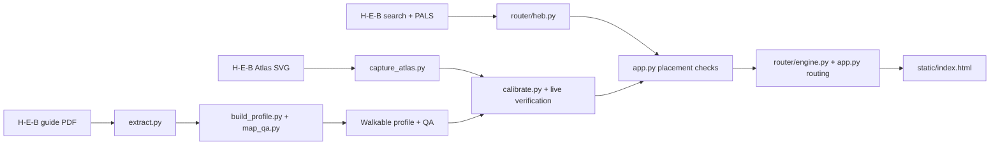

# Maintenance review — 2026-09-28

First pass: product placement, store onboarding, map readability, and deployment
configuration. The release candidate includes the existing local work and was
prepared on current GitHub `main` in an isolated checkout. The original working
copy was preserved.

Validation: the original suite passed 2,641 tests with one skip. After the code
changes, the complete release suite passed **2,657 tests with one skip** in
53.58 seconds, using an isolated runtime and local guide PDFs. Shell syntax,
Python compilation, and `git diff --cached --check` passed. Browser checks
confirmed equal map/image bounds on mobile and desktop with no console errors.
Live catalog access was not exercised in that isolated local preview.

## What was wrong and what changed

| Finding | Change | Evidence |
|---|---|---|
| `approximateLocation` from H-E-B became an exact shelf pin. | Approximate input uses the named aisle/department and the dashed marker. | PALS → locate API regression using the saved #659 Atlas. |
| A valid shelf in the wrong aisle passed because it landed on walkable floor. | Runtime placement now uses the same aisle-segment agreement check as calibration. Conflicts fall back to the displayed label. | #811 aisle-5 shelf with an aisle-4 label reproduced an incorrect exact pin. A matching aisle-4 shelf still retains its depth. |
| Rejected off-floor coordinates were reused when there was no fallback label. | Products without a defensible fallback remain unrouted. Fallback route groups follow the named area. | A #659 pallet location previously snapped about 25 m back onto the shopping floor. |
| Cached pins could survive changed placement rules or calibration, and routing bypassed catalog eligibility. | Pins carry an internal policy version and calibration fingerprint; changed fits reload the cached map; selected-product routes recheck eligibility. | Tests cover old cache entries, a changed fit, and a blocked calibration. |
| Offline calibration could publish `pass` before live verification; browser failure left it enabled. | CLI writes a pending candidate before browser work. Only successful live verification publishes a new passing fit. The browser closes on failure. | Tests fail with the original code and cover both offline-only and failed live runs. |
| Verification could count one product repeatedly, or count approximate geometry as exact evidence. | Each product contributes once; approximate placements cannot establish shelf accuracy. | Repeated results across all probes now count as one observation. |
| Mobile route SVG was 65vh high while the floor image filled a taller container. | The shared container sets mobile height, so both layers use identical bounds. | Browser measurements and visual check at 390 × 844. |
| Map colors and pins had no explanation. | Added a collapsible legend for route, pick order, shelf/area confidence, start, checkout, and floor colors. | Mobile and desktop browser inspection. |
| A normal onboarding retry restarted the expensive map agents. | Default retries reuse successful rebuild checkpoints; explicit `--from` still overrides. | Shell tests exercise fresh, onboarded, audited, and explicit-resume cases without launching agents. |

The public API keeps the existing `exact`/`department` state names for
compatibility. The UI calls the latter an **approximate aisle or department**.
An exact pin is still an estimate of where to stand beside a shelf, based on
H-E-B's data and map calibration; it is not physical inventory confirmation.

## Project map

`pipeline.sh` coordinates map preparation, audit, tests, and calibration.
`scripts/fleet_drive.sh` manages batches. `scripts/promote_stores.sh` commits
store artifacts, updates the Docker allowlist, pushes code, and transfers
anonymous H-E-B session state. `Dockerfile`, `railway.toml`, and
`scripts/start.sh` define the serving environment.

## Is the H-E-B method appropriate?

Using store-specific product IDs, H-E-B locations, and Atlas shelf geometry is
better supported than guessing locations from product names or category text.
H-E-B itself describes PSA as a product's in-store address and exposes product
locations on its customer map: [PSA explanation](https://careers.heb.com/blog/simplifying-the-assortment-riddle),
[customer map](https://careers.heb.com/blog/the-app-marks-the-spot).
These public descriptions support the approach, not the correctness of any
particular saved product location or a stability guarantee for the endpoints.

The fragile part is carrying those coordinates onto a separate PDF, which may
have different aisle numbering or an older layout. Browser navigation, embedded
Next.js data, and the PALS/Atlas response shapes are additional dependencies.
This review found no documented public API contract for this integration.

Recommendation: retain this source for the current pilot, require honest
fallbacks and live evidence, and evaluate an Atlas-native walkable map as a
bounded next experiment. It could remove the cross-map calibration step, but
Atlas fixtures alone do not prove entrances, boundaries, or every walkable
connection. Compare both methods on #659, #811, and a difficult store before
replacing the existing pipeline. No provider or map rewrite was made here.

## Accuracy work still needed

- Capture the specific wrong product IDs and the deployed URL, then replay the
  live search → PALS → Atlas → displayed pin chain. This review used saved
  store geometry and controlled responses; it did not verify today's shelves.
- Local inventory: 46 built profiles, 39 passing calibrations. Eleven passing
  records have no passing `verified` evidence: **24, 96, 172, 227, 229, 265,
  269, 382, 401, 659, 790**. Historical records were preserved; reverify them
  before claiming fleet-wide accuracy. #811 has saved 11/11 label agreement,
  which is sample evidence, not a present-day guarantee.
- Bind calibration to the exact guide/profile/Atlas content and refresh live
  Atlas validation periodically. Currently session confirmation checks the live
  digest, but persisted session validity is a comparison of saved digests.
  Recapturing an Atlas without recalibrating remains unsafe.
- Broaden verification to distinct aisles and department edges. Numbered-aisle
  agreement cannot prove that an unnumbered Bakery/Dairy shelf is correct, and
  nearest-badge agreement remains a heuristic.

## Onboarding sequence

1. **Implemented:** resume from successful map checkpoints; preserve live
   verification as the publication gate. `--from 1` forces a fresh run.
   `--no-agents` remains a mechanical-only run. Automatic resume assumes the
   same source data; use explicit stages after changing a guide or map truth.
2. **Next:** move cheap source compatibility and browser-availability checks
   ahead of agent work. Record stage durations so improvements are measured.
3. Replace stage-number guessing in the operator UI with the next required
   action and its evidence: map review, live verification, or publication.
   Keep one operator job per machine; concurrency is not the current accuracy
   fix.
4. Trial Atlas-native mapping only after the above gates are observable.

## Deployment findings and release steps

The configuration starts one Uvicorn worker and Chrome under Xvfb, with browser
state expected on a Railway volume at `/app/runtime`. This matches the code's
single browser queue. Actual Railway volume attachment, variables, deployed
revision, and restart behavior were not inspected.

Release checks and remaining production acceptance:

1. Completed: reviewed and included the existing tracked changes, with the
   full suite run under an isolated `HEB_RUNTIME_DIR` to protect operator caches.
   Guide PDFs stay local and are removed from Git as requested by the existing
   staged cleanup; tests that need guides require those local inputs.
2. Completed: regenerated the Docker allowlist for **39** passing stores.
   **94 and 102** are now included; **182** is excluded because its calibration
   fails. The required map artifacts are tracked in Git.
3. Run onboarding on the operator machine. The current serving image excludes
   tests and does not install the agent CLI, so the public app's full onboarding
   action cannot complete there. A production operator workflow must expose
   this distinction before presenting onboarding as available.
4. Deploy the reviewed code and approved artifacts, confirm the admin token and
   persistent runtime volume, then bootstrap anonymous store sessions as needed.
   Reload open clients so saved products are located under the new rules.
5. Verify search → locate → route on production, including an approximate item
   and an unresolved item. `/api/health` only proves the process is alive.
   The current promotion smoke check accepts a successful HTTP locate response
   without asserting `routable` or route geometry; strengthen that check before
   relying on it as release acceptance.
6. Run the existing `soak_heb.py` acceptance test and controlled restarts.
   Check source freshness and session recovery. No CI workflow is present in
   this checkout, and dependencies/Chrome are not version-pinned, so a later
   deployment-hardening pass should add a repeatable build and release gate.

Full redesign and production acceptance remain follow-up work. The fixes here
address reproduced code failures without asserting that every physical shelf,
historical calibration, or deployed session is correct.
